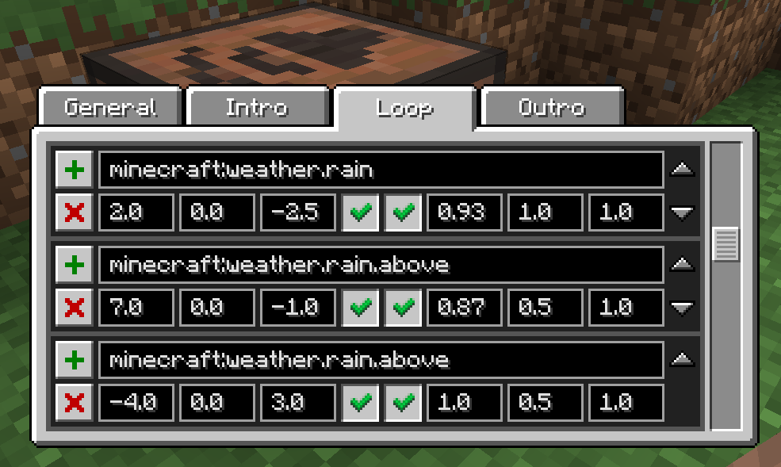

## NOTE:
This README is a work in progress and may change significantly in the future.

---

# SoundBlock

This mod adds a single block - the **Sound Block**.

With it, you can play positional sounds (similar to the `/playsound` command), but from within survival mode. The mod is intended to give players a way to make their worlds feel more alive and immersive (especially by leveraging custom resource packs). But it can also be used for other purposes, such as giving automated factories a way to signal special events using audio (e.g. industrial alarms), or handling world-wide broadcasts (e.g. for curated server events).

## How does it work?

Start by crafting a **Sound Block**. The default recipe requires a Jukebox and a Music Disc (any type).

Next, place the block and right click it to open the GUI.

The interface is separated into 4 tabs: **General**, **Intro**, **Loop** and **Outro**. The **General** tab contains master settings that govern all sounds played by the block. The other 3 tabs each represent a phase of the sound block's use cycle, and each contain a list of sounds to be played in that phase.
- Sounds listed in the **Intro** tab are played *once*, as soon as the Sound Block is activated.
- Sounds listed in the **Loop** tab will play *indefinitely*, as soon as the loop delay (starting with the **Intro** phase) has elapsed, and as long as the Sound Block remains active. Whenever a sound in this list finishes, it is replayed from the beginning - meaning each sound looks individually.
- Sounds listed in the **Outro** tab are played *once*, as soon as the Sound Block is deactivated.

A sound block is said to be "activated" if:
- it is powered by a redstone signal, or
- the "force-powered" checkbox in the **General** tab is checked.

The **Intro** phase correlates with the block's state transition from being *deactivated* to  being *activated*, while the **Outro** phase correlates with the block's transition from being *activated* to being *deactivated*.

---

## TODO:
- Explain the general tab
- Explain the purpose of each text field in sound entries
- Reference Minecraft resource pack sounds definitions
- Add a note for server admins
- Make a video showcasing the mod?